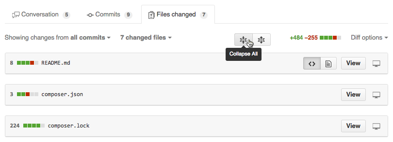
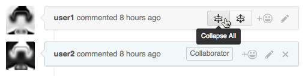
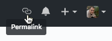
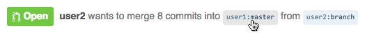

# GitHub Tweaks

Userscript that adds tweaks to GitHub.

## Installation

GitHub Tweaks can be installed on a **PC**, or a **Mac**.
Simply choose the plugin that corresponds to your web browser below and download the script, as easy as that!

1. Which browser?
  - **Firefox**: Install the [GreaseMonkey] plugin.
  - **Chrome**: Install the [Tampermonkey] plugin.
  - **Opera**: Install the [ViolentMonkey] extension.
  - **Safari** & **Internet Explorer**: *NOT SUPPORTED!*

2. GitHub Tweaks script can be found here (just choose any one)
  - [Get it on OpenUserJS.org]
  - [Get it on GreasyFork]
  - [Get it on GitHub]

## Details

Here's what this script does for you / adds to the GitHub website.

### Toggleable File Diffs

When viewing the changed files of a PR, branch comparison or a single commit, you can now collapse and expand the files by clicking the individual file headers.
Alternatively, you can collapse and expand all at the same time by clicking one of the new buttons at the top.

### Toggleable Comments

When viewing a conversation of an issue or PR, you can now collapse and expand the comments by clicking the individual comment headers.
Alternatively, you can collapse and expand all at the same time by clicking one of the new buttons in the topmost comment header.
For hidden comments, the first part of the content gets added to the comment header as a tooltip.

### Permalink to current page

A link with the permalink to the current page gets added to the top right into the user links.

## Implemented by GitHub

### Commit Ref Links

When viewing a PR, there is a short summary text similar to this at the top:

- **user2** wants to merge 8 commits into `user1:master` from `user2:branch`

The `user1:master` and `user2:branch` placeholders are now links to the respective branches.

(this applies to all `user:branch` placeholders wherever they appear)

## Obsolete and removed

Here are features that don't apply anymore, due to GitHub changes.

### Pull Info Links

On the dashboard, the pull info fields are now linked to the PR's "Files changed" tab for quick access.

## Changelog

### Unreleased

- Remove Commit Ref Links which have been implemented by GitHub directly.
- Remove Pull Info Links which are obsolete since GitHub's new dashboard.

### 2.8

- Improve userscript initialisation.
- Fix tooltip for folded comments. Error was due to clearfix added by GitHub.

### 2.7

- Add fold/unfold buttons when viewing a single commit.

### 2.6.1

- Add permalink of the current page to user links.

### 2.6

- Remove built-in GitHub file collapse toggle, due to a very different approach of showing/hiding content.

### 2.5.1

- Fix fold/unfold buttons to work correctly even after changing tabs in PR view.

### 2.5

- Make fold/unfold buttons react to specific selectors instead of elements. This means that newly added comments also get toggled correctly.

### 2.4.1

- Fix for class rename on GitHub.

### 2.4

- Add Pull Info Links on dashboard.

### 2.3

- Refresh tweaks on page content change, so that new inline comments instantly become toggleable.
- Add content tooltip to comment header when content is collapsed.
- Add missing tooltips to comment action buttons.

### 2.2

- Fix Commit Ref Links for unknown repositories.

### 2.1

- Add Toggleable File Diff buttons when viewing a single commit.

### 2.0

- Add Toggleable Comments.
- Code rewrite / restructure.

### 1.1

- Change position of Toggleable File Diff buttons.
- Add Toggleable File Diff buttons to branch compare.

### 1.0

- First version, adding Commit Ref Links and Toggleable File Diffs.

[GreaseMonkey]: https://addons.mozilla.org/en-US/firefox/addon/greasemonkey/ "GreaseMonkey for Firefox"
[Tampermonkey]: https://chrome.google.com/webstore/detail/tampermonkey/dhdgffkkebhmkfjojejmpbldmpobfkfo?hl=en "Tampermonkey for Chrome"
[ViolentMonkey]: https://addons.opera.com/en/extensions/details/violent-monkey/ "ViolentMonkey for Opera"
[Get it on OpenUserJS.org]: https://openuserjs.org/install/noplanman/GitHub_Tweaks.user.js "OpenUserJS.org"
[Get it on GreasyFork]: https://greasyfork.org/en/scripts/20340-github-tweaks/code/GitHub_Tweaks.user.js "GreasyFork"
[Get it on GitHub]: https://raw.githubusercontent.com/noplanman/GitHub-Tweaks/master/GitHub_Tweaks.user.js "GitHub"
